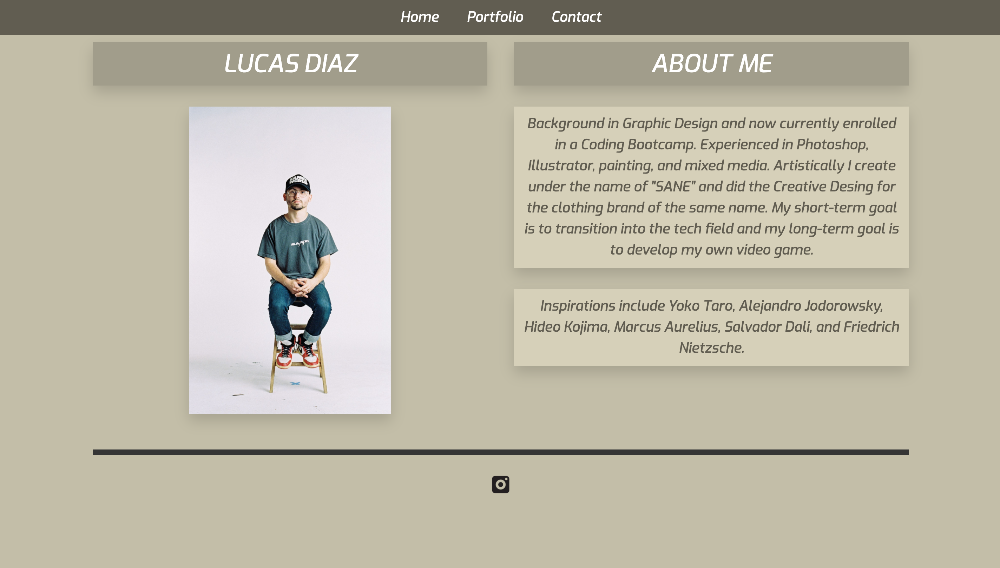
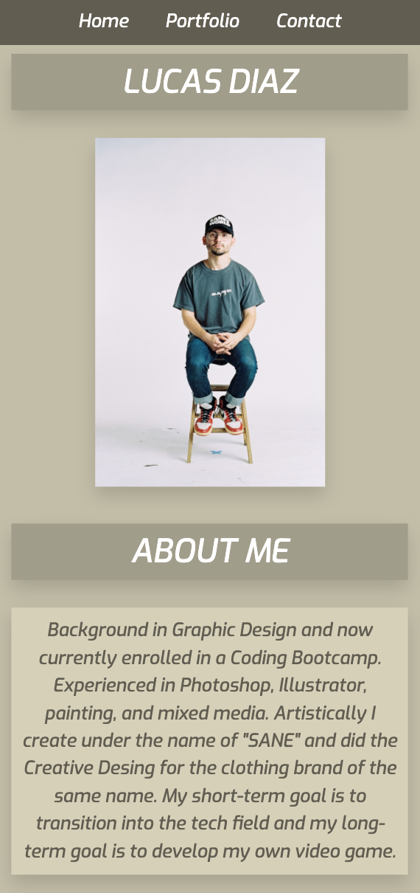

# Homework_02
Responsive Portfolio

## Requirements

* Functional, deployed application

* GitHub repository with README describing the project

* Navbar must be consistent on each page.

* Navbar on each page must contain links to Home/About, Contact, and Portfolio pages.

* All links must work.

* Must use semantic html.

* Each page must have valid and correct HTML.

* Must contain your personalized information. (bio, name, images, links to social media, etc.)

* Must properly utilize Bootstrap components and grid system.

## Files & directories
*index.html 
*contact.html
*portfolio.html
*assets:
    *style.css
    -images:
         background.png
         event.jpg
         event2.jpg
         FanSite.png
         ig.png
         painting1.jpg
         painting2.jpg
         painting3.jpg
         poster.jpg
         profilepic.jpg
         profilepic2.jpg
         profilepic3.png
         screenshot1.png
         screenshot2.png
         
**Design and Features**
	-Minimal design with focus on stylish aesthetic 
    -Orange hover effect on clickable items such as Github link and Navbar items
    -Bootstrap Carousel on Portfolio showcasing works
    -Sticky Navbar
    -Opted against sticky footer for design purposes
    -Clicking the instagram logo on any page will open my personal page in a new tab
    -Semantic html tags
    

## Credits
Built & designed by Lucas Diaz